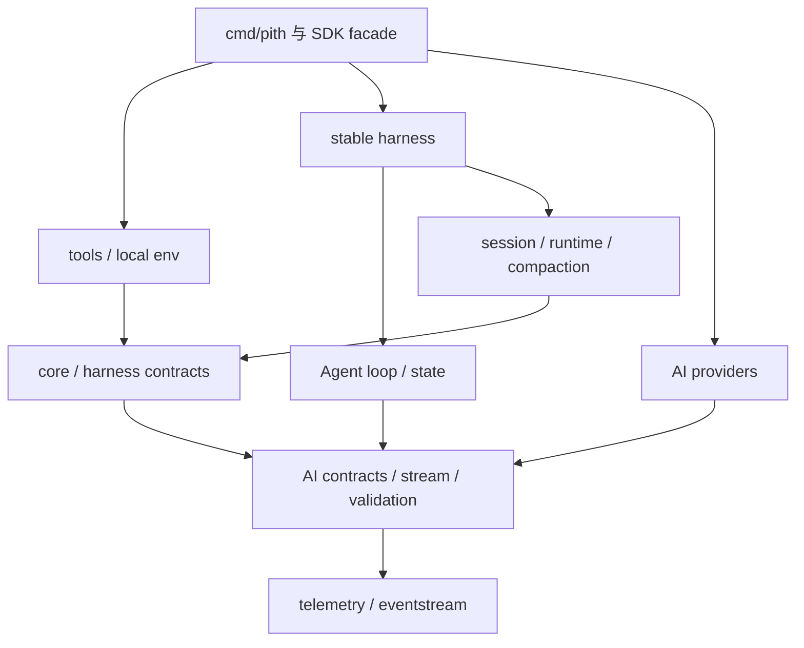

# 依赖替换与差异登记

模块交付顺序为 ai → core → tools；ai 内部包括必要 telemetry，core 内部包括必要 Context/JsonValue/JsonRepresentation 适配，不新增用户操作模块。

## 依赖策略

优先标准库；成熟三方库可以使用。**库的存在不代表语义等价**。实施每批次前，用原 TS fixtures 做小型兼容探针，选定后固定版本、校验值、许可证、最低 Go 版本和升级理由。生成模型不得自行 go get 最新版本。

| TS / 上游依赖                      | Go 方案                                                                                                                   | 必须验证                                                                        |
| ---------------------------------- | ------------------------------------------------------------------------------------------------------------------------- | ------------------------------------------------------------------------------- |
| TypeBox/schema/compile/value       | 已有 `github.com/santhosh-tekuri/jsonschema/v6 v6.0.2`；coercion 自写薄适配                                               | 联合分支、refs、nullable、optional null、默认值/额外字段和错误路径              |
| OpenAI / Anthropic / Google JS SDK | net/http、encoding/json、bufio 的协议适配优先；必要时改用官方 Go SDK                                                      | 所有实际使用的协议字段/headers/stream，不以 SDK 默认值代替上游行为              |
| AWS SDK / Smithy                   | [AWS SDK for Go v2](https://github.com/aws/aws-sdk-go-v2) 的 bedrockruntime/config/credentials 等模块，bedrockruntime v1.63.1 / config v1.33.6 | 签名、profile/环境凭据、endpoint、事件流及 retry；不能用普通 SSE 假替代 Bedrock |
| OAuth / ADC                        | [golang.org/x/oauth2](https://pkg.go.dev/golang.org/x/oauth2) v0.28.0；各厂商特殊流程仍保留                              | PKCE、device polling、refresh、callback、凭据优先级和锁                         |
| WebSocket                          | [github.com/coder/websocket](https://github.com/coder/websocket) v1.8.15                                         | Codex 会话复用/取消/重连/回退，不能只证明 echo 成功                             |
| partial-json                       | 移植独立增量解析语义或通过 fixtures 选库                                                                                  | incomplete string/object/array、嵌套、转义、非法尾部、最终严格参数              |
| http(s)-proxy-agent                | net/http.Transport/Proxy 与独立 TLS 配置                                                                                  | proxy/env/NO_PROXY、CONNECT、headers、重试和证书行为                            |
| Node fs/child_process/crypto/zlib  | os/io/fs/os/exec/path/filepath/crypto/compress                                                                            | 编码/CRLF/权限、取消进程树、输出落盘、UUID 和哈希                               |
| yaml                               | [github.com/goccy/go-yaml](https://github.com/goccy/go-yaml) v1.19.2                                             | frontmatter/schema/aliases/重复键与现有 fixtures，不能静默接受不同类型          |
| ignore                             | github.com/sabhiram/go-gitignore v0.0.0-20210923224102-525f6e181f06，差异薄适配                                         | negation、嵌套、目录、路径分隔和顺序                                            |
| diff                               | github.com/sergi/go-diff v1.4.0，patch 文本差异使用格式适配                                                 | hunk、BOM/CRLF、多字节、上下文与 firstChangedLine                               |
| Chord                              | 标准 context 加必要 value/cancellation helper；只迁移本项目实际使用的 Context/JsonValue/JsonRepresentation                | 承诺的 Context 行为；不能带入完整服务/插件 runtime                              |
| pi-telemetry                       | 迁移接口、memory/no-op/conformance                                                                                        | 父子 span、attrs、end/error/cancel、关闭次数；默认不发远程遥测                  |
| 模型目录生成数据                   | 同版本离线 JSON + go:embed + hash manifest                                                                                | 来源一致性、价格/能力/时间戳、每个 provider 对应的模型集合                      |
| Vitest / tsgo                      | 原 TS 行为 oracle + Go testing；类型探针放独立构建步骤                                                                    | 上游测试场景逐条映射，不能只搬 assert 名称                                      |

Go 依赖已写入根 go.mod/go.sum。`readiness/dependencies.json` 记录版本、许可证文件 hash、Go 版本和 8 组实际兼容探针（含 race）。这证明可用的依赖能力，不证明与 Pi 的完整语义等价；协议/工具的行为仍由迁移测试验收。oauth2 固定 v0.28.0 以支持当前 Go 1.24。

## 允许的差异

| ID  | 差异                                            | 接受条件                                                     |
| --- | ----------------------------------------------- | ------------------------------------------------------------ |
| D01 | Go error/结构化错误代替 TS throw                | 分类、工具结果状态与会话影响相同；无须逐字复制框架错误堆栈   |
| D02 | immutable snapshot 代替共享可变 partial 引用    | 消费者看到的内容与事件顺序一致；并发无 race                  |
| D03 | context 取消、所有权和 goroutine 生命周期显式化 | 无吞事件、悬挂、重复工具执行；测重入和资源关闭               |
| D04 | Go 包布局与 SDK aliases                         | 所有源符号都有去向；无包环；消费者无需内部源码               |
| D05 | Node/Bun/Cloudflare runtime adapter             | 对可模拟的协议保行为；平台不可用能力明确报告，不静默成功     |
| D06 | Pith 增强：轮次上限、受限 FS、额外日志          | 默认兼容路径不受影响；独立配置、文档及测试；不能偷换兼容语义 |

旧版“只顺序、只文本、只 DeepSeek、不做 OAuth、只读 root”全部取消为全量目标的默认限制。新发现的缺口不得放进允许差异躲过验收；必须回到计划明确处理。

## 已补齐的生成目录

Git 快照没有 `packages/ai/src/providers/data/` 的生成 JSON，静态分析有 42 处对应引用。已从 npm 的 @earendil-works/pi-ai@0.87.1 固定发布物提取 42 个 JSON 文件，并用已锁定 sha512 integrity 验证归档。来源、归档与逐文件 hash、MIT 归属见 assets/catalog-manifest.json；它们是同版本发布物的数据，不冒充 Git 中原本不存在的数据。迁移时只读注入并 embed；.manifest.json 在目标改名为 manifest.json。

`importDecisions` 已分类所有纳入文件的直接 import；这不证明第三方语义已等价。Chord 的 barrel/type 文件仅选 Context/JsonValue/JsonRepresentation，其其他服务类型不进入依赖闭包。实验性 pico3 和 benchmark 的排除不传播为稳定功能排除。
