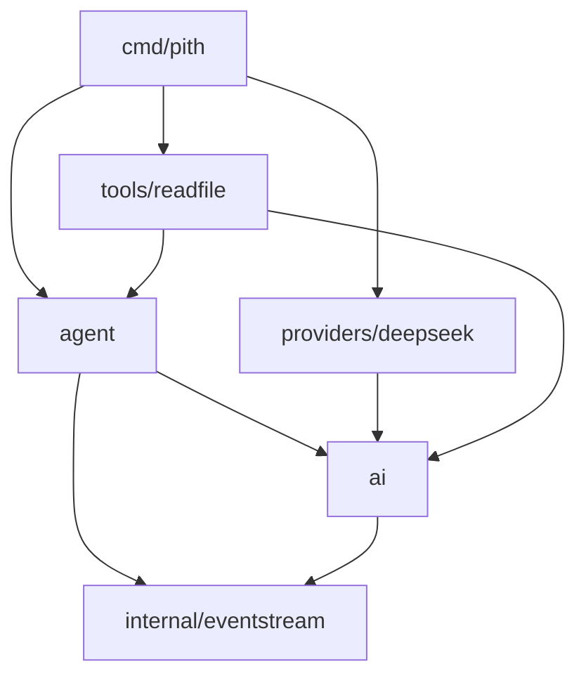

# 依赖边界与 Go 取舍

## 目标包图

箭头表示导入依赖。这是拟定架构，目录尚未创建。

`ai` 拥有公共消息、工具声明与 provider 流协议；`agent` 拥有工具执行与循环。Provider 只实现协议，不导入 Agent；Agent 通过注入调用 provider，不反向导入具体厂商。通用 EventStream 不认识 `ai` 消息类型。这样 TS 中的类型相互引用无需变成 Go 包循环。

## 为什么不直接移植 pi-agent-core 四个文件

固定版本的 `packages/agent/src/{agent,agent-loop,types,stream-fn}.ts` 共 2027 物理行。其中循环运行时仍依赖 pi-ai 的 EventStream、会话规范化、工具状态与声明、参数校验；状态包装又依赖初始 system 消息和当前提示词读取。因此补入 P01—P04 后，P05/P06 才有正确基础。

`pi-ai/src/index.ts` 是汇总导出入口，`types.ts` 还引用多厂商的选项类型。不能把一次 barrel import 当成“需要移植整个 pi-ai”。计划选定下面的符号与协议；其余源码保留在完整缓存中，遇到真实缺口再增加来源与验收。

| 来源与依赖                                       | 迁移办法                                                                          |
| ------------------------------------------------ | --------------------------------------------------------------------------------- |
| EventStream / Queue                              | 保留 FIFO 与终止语义，用 Go 明确同步和取消，不机械把 Promise 改成 channel         |
| types.ts / transcript.ts / text.ts               | 提取文本、工具、会话与流协议；用有序数据结构保留 JS Map 的顺序                    |
| TypeBox 与 Pi validation.ts                      | 成熟 Go JSON Schema 库负责校验；Pi 的 coercion、null 和分支选择行为另行实现与测试 |
| agent-loop.ts / agent.ts                         | 顺序调用循环与状态封装；显式注入模型流函数                                        |
| OpenAI SDK / SSE / partial-json                  | 可用 Go 标准 HTTP/JSON 或成熟库；以请求和流事件 fixtures 判定，保留原始参数增量   |
| DeepSeek provider factory / generated model data | 显式 URL、模型 ID、凭据；不用自动模型目录，不翻译生成 JSON                        |
| read.ts / truncate.ts / ExecutionEnv / 图片库    | 只选文本读取与截断；用 Go 受限目录访问替代整套 harness 环境                       |
| Vitest / 上游集成测试                            | 参考场景和原行为；Go 独立 judge 与候选自测分开，不能把框架本身移植过来            |

标准库优先，允许成熟三方库。Schema 已固定为 jsonschema/v6 v6.0.2（依赖见根 go.mod/go.sum）；HTTP/SSE 使用 Go 标准库实现选定协议。不能为了零依赖重写成熟协议，也不能因为有库就省略兼容性验证。

## 已决定的差异

| 编号 | 第一版 Pith 决定                           | 与 Pi 的区别 / 验证                                                                   |
| ---- | ------------------------------------------ | ------------------------------------------------------------------------------------- |
| D01  | 只顺序执行工具                             | Pi 默认 parallel；测试只在显式 sequential 基线上比较，不提供假 parallel 选项          |
| D02  | provider 及模型显式注入                    | 不引入进程级默认模型、自动目录和 OAuth；缺配置即报错                                  |
| D03  | 公开事件携带快照                           | Pi partial 可是持续修改的同一对象；Go 防止消费者与生产者共享可变数据竞争              |
| D04  | 完整参数 JSON 才能进入执行                 | 不照搬 partial-json 宽松修复对象；流式阶段可保留 raw 参数文本，最终残缺 JSON 报错     |
| D05  | read 只访问注入 root 中普通文本文件        | Pi 默认支持任意路径及图片；采用 Go 1.24+ `os.OpenRoot` 等能力，测试链接逃逸与截断     |
| D06  | 保留 JSON 数字精度，显式处理缺失/null/零值 | Go 类型映射不是 JS 数值的逐位模拟；超出 JS 精确整数范围的行为另记，不静默损坏工具参数 |
| D07  | 补充 context 取消与最大轮次                | 不能导致漏终结事件、重复执行或挂起；上游未定义的 Go 并发行为单独验收                  |
| D08  | 错误使用 Go error 与结构化路径             | 不要求复制 TypeBox 错误全文；要求失败分类、路径、是否执行工具与会话影响一致           |
| D09  | usage 保留实际返回值，价格可缺失           | 无固定价格表时不能把费用 0 当成“免费”；不估造缓存命中量或计费数据                     |

队列 steering/follow-up、运行中配置替换、全部 hooks、图像、其他厂商、模型注册表和完整 harness 均延期。发现超出选定范围的输入时，返回明确的不支持或错误，不用空结果假装成功。

## 扫描的使用边界

`analysis.json` 是完整扫描的 35 文件投影，保留这些文件的全部直接导入边；有些 `target` 在投影以外。`cycles` 仅计算投影内的 TS 文件依赖，包含类型引用。`plan.json` 的任务和 Go 包图另外验证，不能用 TS 文件环直接决定 Go 包划分。

此前扫描器将 `paths` 中的 `* → ./*` 以及指向 `node_modules` 的别名误判为缺失的内部依赖；Portsmith 已补回归场景并修正该分类。真实本地解析仍优先，明确的本地别名缺失仍会报出。完整来源的 60 处剩余项已经保留在审计文件，没有被删除来制造“零告警”。
